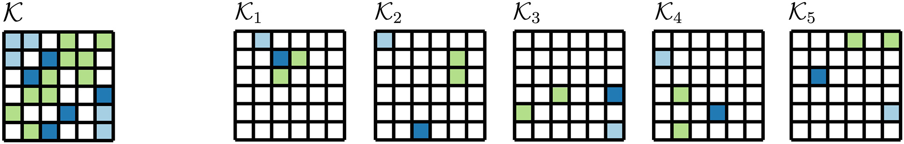
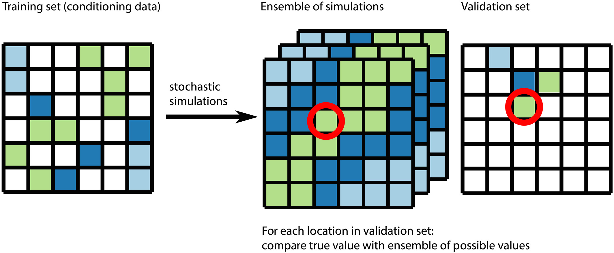

# geocv: Framework for cross-validation of categorical geostatistical simulations

This repository accompanies the following work:  
Juda, P., Renard, P., & Straubhaar, J. (2020). A framework for the cross-validation of categorical geostatistical simulations. Earth and Space Science, 7, e2020EA001152. https://doi.org/10.1029/2020EA001152  
The version of the data and the software cited by the paper: 

## Summary of the workflow

We recommend using stratified 5-fold cross-validation and quadratic (Brier) score.
The spatial dataset is first divided into five subsets.

Then, during each of 5 iterations, one subset is removed from data (it becomes validation set),
and the spatial simulations are performed.

The simulation outcomes are compared with the true values from the reference set
by means of the quadratic score (aka Brier score).

## Reproducing the study
The workflow is presented in jupyter notebooks.
Python 3.6.9 was used to complete the study.
The best is to start with an empty virtual environment
and install all packages.

### Virtual environment
In order to reproduce the environment, 
use pip to install the requirements: `pip install -r requirements.txt`.

This will install jupyter notebook and required dependencies to run notebooks.

### Input data
The input data required to reproduce the results is in `data` directory.

### Running cross-validation
The directories `samples`, `output` and `figures` are empty. They can be populated by running notebooks.

Run notebooks in the following order:
- 1-preprocessing.ipynb,
- 2-results.ipynb,
- 3-analysis.ipynb.

The generated output should be the same as that in the `reference` directory.
